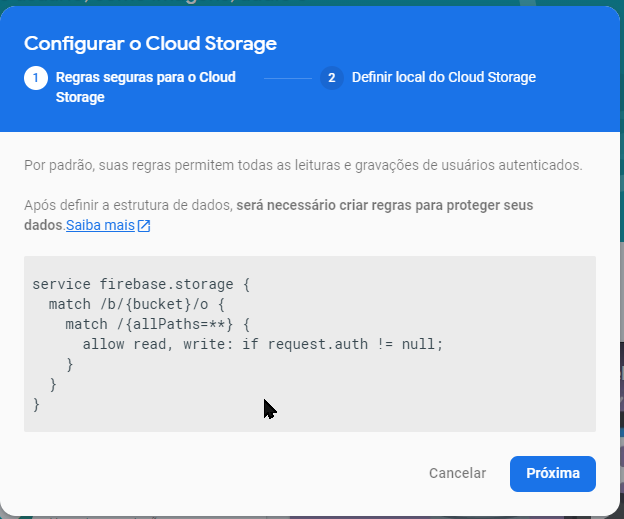
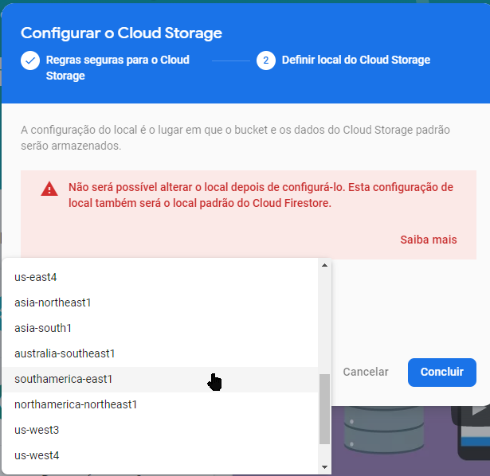
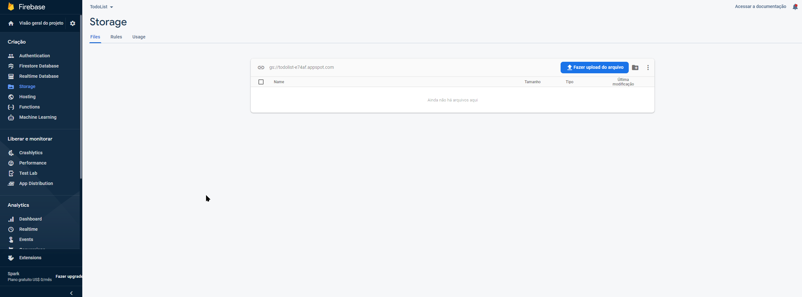

# Cloud Storage
[1. Criando um novo Storage](#criando-no-console)

[2. Acessando o Storage](#acessando-storage)

[3. Gerenciando Uploads](#gerenciando-uploads)

## Criando no console
**Inicialmente você vai no menu e clica em `Storage`, e você verá algo assim:**

**Feito isso você pode definir aqui as regras de segurança se você desejar ou, você pode fazer isso mais a frente.**

**Após isso você deve definir a localização do servidor, cuidado para não escolher um servidor muito distante, pois isso pode aumentar a latência.**

**Aqui ficará os seus arquivos:**

**Aqui você edita as suas regras**

### Colocando o script no arquivo HTML
Para que tudo funcione, você precisa colocar esse script no seu html ``, aqui conterá todas as instruções para carregar toda a funcionalidade do Storage.

## Acessando Storage

[Documentação](https://firebase.google.com/docs/reference/js/firebase.storage)

[Documentação UploadTask](https://firebase.google.com/docs/reference/js/firebase.storage.UploadTask)

[Documentação UploadMetadata](https://firebase.google.com/docs/reference/js/firebase.storage.UploadMetadata)

###### Método Storage Assinatura
    storage ( app ? :  App ) : Storage

>Obtem o serviço de `Storage` padrão do app ou retorna um app. `firebase.storage()` pode ser chamado sem argumentos para acessar o `app` padrão de serviço de armazenamento ou como `firebase.storage(app)` para acessar o serviço de armazenamento associado a um app específico.

###### Exemplo de upload de arquivo
[todo.js](js/todo.js)

    var file = todoForm.file.files[0] // Seleciona o primeiro aquivo da seleção de aquivos

    if (file != null) { // Verifica se o arquivo foi selecionado
      if (file.type.includes('image')) { // Verifica se o arquivo é uma imagem
        // Compõe o nome do arquivo
        var imgName = firebase.database().ref().push().key + '-' + file.name
        // Compõe o caminho do arquivo
        var imgPath = 'todoListFiles /' + firebase.auth().currentUser.uid + '/' + imgName

        // Cria uma referência de arquivo usando o caminho criado na linha acima
        var storageRef = firebase.storage().ref(imgPath)
        
        // Inicia o processo de upload
        storageRef.put(file)
      }
    }

**Aqui `var imgName = firebase.database().ref().push().key` você pega uma chave criado pelo método PUSH, no caso essa expressão cria uma chave que será usado para compor o nome do arquivo, uma vez feito isso, a próxima instrução é a criação do *PATH*, conforme visto aqui: `var imgPath = 'todoListFiles /' + firebase.auth().currentUser.uid + '/' + imgName`, nesse caso será criado um path aonde `imgName` será usado para o nome do arquivo e `imgPath` para criar um caminho, conforme ilustrado abaixo:**

**Uma vez feito isso, você deve usar o método storage para fazer o upload, aqui você cria uma referência `var storageRef = firebase.storage().ref(imgPath)` com base no *PATH* e por fim você deve usar o método `put` para fazer upload, sendo `firebase.storage().ref(imgPath).put(file)`, ou seguindo a lógica do código acima:**

    // Cria uma referência de arquivo usando o caminho criado na linha acima
        var storageRef = firebase.storage().ref(imgPath)
        
    // Inicia o processo de upload
        storageRef.put(file)

## Gerenciando Uploads
### Método Put
    put ( data :  Blob | Uint8Array | ArrayBuffer ,  metadata ? :  UploadMetadata ) : UploadTask

>Carrega dados para a localização desta referência.

#### Parametros
    data: Blob | Uint8Array | ArrayBuffer
    Os dados para upload.

    Opcional metadata: UploadMetadata
    Metadados para o objeto recém-enviado.

#### Retorna UploadTask
    Um objeto que pode ser usado para monitorar e gerenciar o upload.

### Barra de progresso com uploads
[Documentação de firebase.storage.UploadTask](https://firebase.google.com/docs/reference/js/firebase.storage.UploadTask)

**Aqui usaremos um exemplo com o método `put` do método `ref`, que por sua vez vem do método `storage` que que é um método do objeto do `firebase`.**

    var storageRef = firebase.storage().ref(imgPath)
    var upload = storageRef.put(file)
    trackUpload(upload)

**O gerenciamento será melhor visto dentro dessa função `trackUpload(upload)`, no caso é passado como parametro `trackUpload(firebase.storage().ref(imgPath).put(file))`, a `imgPath` foi explicado melhor acima e o `file`, é um atributo pego do formulário, conforme visto aqui `var file = todoForm.file.files[0]`,ou seja `trackUpload(firebase.storage().ref([PATH]).put([FILE]))`, `[PATH]` corresponde ao Path da coleção, conforme [visto aqui](#exemplo-de-upload-de-arquivo) e o `[File]` correspondendo ao input do tipo `file` no formulário.**

###### Gerenciando upload, função trackUpload - código de trackUpload

    //Rastreia o progresso de upload e Gerencia
    function trackUpload(upload){
        showItem(progressFeedBack);
        upload.on('state_changed', 
            function(snapshot){ //Segundo argumento: Recebe informações, sobre o upload
                console.log(snapshot);
                var status = (snapshot.bytesTransferred / snapshot.totalBytes * 100).toFixed(2) + "%";
                console.log(status)
                ProgressEvent.value = status;
            },
            function(error){//terceiro argumento: Executando quando ocorre erro.
                console.log(error);
                showError("Houve uma falha no upload da imagem!",error )
                hideItem(progressFeedBack);
            },
            function(){ //Executado caso tudo de certo.
                console.log("Sucesso no upload");
                hideItem(progressFeedBack);
            })

        //Pausar e retomar
        var playPauseUpload = true //Estado de controle do upload (pausado ou em andamento)
        playPauseBtn.onclick = function(){ //Botao pausar/continuar de upload quando clicado.
            playPauseUpload = !playPauseUpload; //inverte o estado de controle do upload
            if(playPauseUpload){ //Se deseja retomar o upload.
                upload.resume(); //Retoma o upload
                playPauseBtn.innerText = "Pausar";
                console.log("upload retomado");
            }else{ //Se deseja pausar o upload.
                upload.pause(); //Pausar o upload
                playPauseBtn.innerText = "Continuar";
                console.log('upload pausado');
            }
        }

        //Cancelar
        cancelBtn.onclick = function(){ //Botão para cancelar upload clicado
            (confirm('Deseja realmente cancelar o upload')) && upload.cancel(); //Cancela o upload
        }
    }

### Método on    
    function trackUpload(upload){
        showItem(progressFeedBack);
        upload.on('state_changed', 
            function(snapshot){ //Segundo argumento: Recebe informações, sobre o upload
                console.log(snapshot);
                var status = (snapshot.bytesTransferred / snapshot.totalBytes * 100).toFixed(2) + "%";
                console.log(status)
                ProgressEvent.value = status;
            },
            function(error){ //terceiro argumento: Executando quando ocorre erro.
                console.log(error);
                showError("Houve uma falha no upload da imagem!",error )
                hideItem(progressFeedBack);
            },
            function(){ //Executado caso tudo de certo.
                console.log("Sucesso no upload");
                hideItem(progressFeedBack);
            })
    }

**O método `put` de `firebase.storage().ref()` retorna um objeto do tipo `UploadTask` ao qual contém métodos que permite gerenciar e observar o upload no momento em que ocorre, nesse caso acima temos o método `on`, que reage a determinados eventos, no caso com o `upload.on('state_changed',...`, a função `on` aceita quatro argumentos, o primeiro é o evento a ser monitorado, nesse caso o `state_changed`, que é quando um upload é realizado, logo esse listener é ativado e mais três callbacks, sendo a primeira, tendo um objeto do tipo `UploadTaskSnapshot`, mais explicado abaixo:**

#### firebase.storage.UploadTaskSnapshot
[Documentação](https://firebase.google.com/docs/reference/js/firebase.storage.UploadTaskSnapshot)

>Mantém dados sobre o estado atual da tarefa de upload.
##### bytesTransferred
    UploadTaskSnapshot.bytesTransferred: number
>O número de bytes que foram enviados com sucesso até agora.

##### downloadURL
    UploadTaskSnapshot.downloadURL: string | null
>deprecated: Use Reference.GetDownloadOverRL em vez disso.Esta propriedade será removida em uma versão futura.

##### metadata
    UploadTaskSnapshot.metadata: FullMetadata
>Antes que o upload seja concluído, contenha os metadados enviados para o servidor.Após a conclusão do upload, contém os metadados enviados de volta do servidor.

##### ref
    UploadTaskSnapshot.ref: Reference
>A referência que gerou esta tarefa de upload deste snapshot.

##### state
    UploadTaskSnapshot.state: TaskState
>O estado atual da tarefa.

##### task
    UploadTaskSnapshot.task: UploadTask
>A tarefa dos quais este é um snapshot.

##### totalBytes
    UploadTaskSnapshot.totalBytes: number
>O número total de bytes a ser carregado.

**Ou seja é através desse objeto `UploadTaskSnapshot` retornado por `firebase.storage().ref([PATH]).put([FILE]`, que você pode ter informações sobre o upload, como metadados, ou o tamanho do arquivo ou até mesmo quantos bytes foram enviados.**

**A segunda callback passada como argumento é executada em caso de algum erro, lembrando que o cancelamento do upload por parte do usuário dispara um erro aqui também e por fim é executado uma função de callback, que no caso é o ultimo argumento, depois que todo o processo é concluído.**

###### Assinatura
        on ( event :  TaskEvent ,  nextOrObserver ? :  StorageObserver < UploadTaskSnapshot > | null | ( ( snapshot :  UploadTaskSnapshot ) => any ) ,  error ? :  ( ( error :  FirebaseStorageError ) => any ) | null ,  complete ? :  firebase.Unsubscribe | null ) : Function

### Pausando e retomando upload
    function trackUpload(upload){
        //Pausar e retomar
            var playPauseUpload = true //Estado de controle do upload (pausado ou em andamento)
            playPauseBtn.onclick = function(){ //Botao pausar/continuar de upload quando clicado.
                playPauseUpload = !playPauseUpload; //inverte o estado de controle do upload
                if(playPauseUpload){ //Se deseja retomar o upload.
                    upload.resume(); //Retoma o upload
                    playPauseBtn.innerText = "Pausar";
                    console.log("upload retomado");
                }else{ //Se deseja pausar o upload.
                    upload.pause(); //Pausar o upload
                    playPauseBtn.innerText = "Continuar";
                    console.log('upload pausado');
                }
            }
    }

**No objeto retornado por `firebase.storage().ref([PATH]).put([FILE]`, existe mais três métodos além do `on`, sendo eles `.resume()` para continuar um upload pausado, `.cancel()` para cancelar um upload, esse método lança uma exceção, informando que o usuário cancelou, por fim `.pause()` que pausa o envio do download, é válido ressaltar que quando o download é retomado, geralmente tem uma pequena um grande retrocesso na barra de upload, mas após isso continua.**

#### pause
    pause ( ) : boolean
>Pausa uma tarefa em execução. Não tem efeito em uma tarefa pausada ou falhada.

    Retorna boolean
>True se a pausa teve um efeito.

#### resume
    resume ( ) : boolean
>Retoma uma tarefa pausada. Não tem efeito em uma tarefa em execução ou falhada.

    Retorna boolean
>True se o método resume teve um efeito.

#### cancel
    cancel ( ) : boolean
>Cancela uma tarefa em execução. Não tem efeito em uma tarefa completa ou falhada.

    Retorna boolean
>True se o cancelamento teve um efeito.