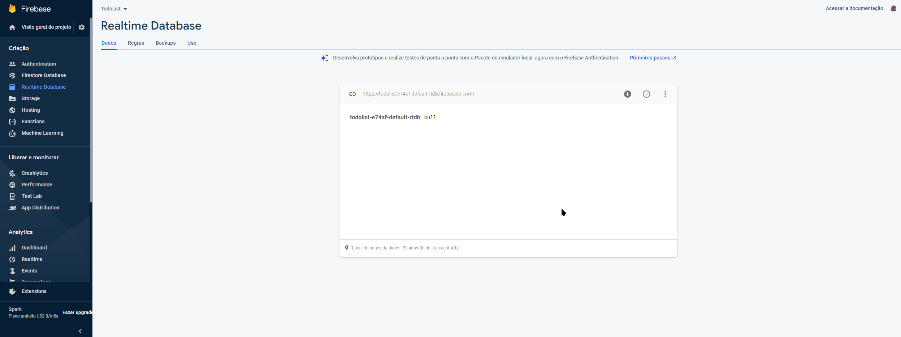

# Realtime Database

[1. Instalando o Firebase Realtime Database](#instalando-o-firebase-realtime-database)

[2. Implementando no projeto](#implementando-o-reatime-database-no-projeto)

[3. Adicionando Registro](#adicionando-registro)
## Instalando o Firebase Realtime Database
>O Firebase Realtime Database é um banco de dados NoSQL na nuvem que possibilita a sincronização de dados em tempo real no formato JSON.

### Configurar banco de dados

#### Opções de banco de dados
**Ao clicar no botão `criar banco de dados`, pelo menos por hora, você verá uma tela como essa abaixo, aonde você deve definir, em qual servidor ficará a aplicação.**

#### Regras de segurança

    

        
        
<b>O modo bloqueado é o modo padrão e recomendado para ambientes de produção, e obviamente recomendado</b>

    

     
    

        
        
<b>Nesse modo tanto a escrita como a leitura está liberado, não recomendado para ambiente de produção, mas útil em ambiente de desenvolvimento.</b>

    
    

#### Uma vez criado você verá uma tela como essa abaixo:

**Naqueles três pontinhos a direita, você tem um menu parecido com esse abaixo, como você pode perceber é possível importar arquivos do tipo JSON para cá, e para fazer backups automático, você precisa pagar por uma assinatura, pelo menos a mais básica.**

**Existe a opção de habilitar, as legenda para ter um melhor feedback visual dos dados.**

**Dessa forma abaixo, você pode adicionar coleções manualmente.**

### Adicionando Childs

    

        
        
<b>Quando você adiciona um campo sem valor, ele se torna um objeto, conforme ilustrado na imagem.</b>

    

     
    

        
        
<b>Porém quando você adiciona valor o campo passa a ser de um tipo primitivo.</b>

    
    

### E ao clicar em adicionar você tem:

## Implementando o Reatime Database no projeto
[Documentaçao](https://firebase.google.com/docs/database?authuser=0)
### Implementando o script
Para que o firebase funcione no seu projeto, usando o javascript vanilla, você precisará implementar o *javascript* correspondente: ``

### Usando objeto do método firebase.database()
> Para ler ou gravar dados no banco de dados, você precisa de uma instância de `firebase.database.Reference`:

    var database = firebase.database()

Um do objeto retornado tem o atributo `ref`, ao qual você pode usar para pegar uma coleção lá no banco de dados.

    firebase.database().ref('users')

No caso esse `users` desse método `ref`, faz referência a essa coleção aqui, lá no realtime database, conforme ilustrado na imagem abaixo:

Ou seja através do método `ref`, você pode pegar uma collection que está registrada lá no firebase.

### Pegando ID do usuário
Para pegar o **ID** da collection, através desse método `firebase.auth().currentUser.uid`, conforme ilustrado na imagem abaixo:

No caso esse método é pego dos registrados registrados, usando o `Firebase Authenticathion`. Nesse caso você pode associar os dados de um usuário autenticado com os dados no firebase conforme ilustrado abaixo:

### Pegando usuário
    const uid = firebase.auth().currentUser.uid;
    firebase
        .database()
        .ref('users')
        .child(uid)

No caso para registrar, você precisa identificar a coleção `.ref('users')`, após isso você precisa identificar o atributo dentro da coleção `.child(uid)`.

## Adicionando Registro
    const uid = firebase.auth().currentUser.uid;
    firebase
        .database()
        .ref('users')
        .child(uid)
        .push({});

### Explicando
Para isso você precisa usar o método push para adicionar registro a nova coleção. No caso dentro do método `push` você deve adicionar o registro dentro da coleção, nesse exemplo acima seria enviado um objeto vazio.

###### Exemplo

    // Trata a submissão do formulário de autenticação
    todoForm.onsubmit = function (event) {
    event.preventDefault() // Evita o redirecionamento da página
        if (todoForm.name.value != '') {
            var data = {
            name: todoForm.name.value
            }

    const uid = firebase.auth().currentUser.uid; 
    dbRefUsers.child(uid).push(data).then(function (e) {
        console.log('Tarefa "' + data.name + '" adicionada com sucesso');
        console.log(e);
    })
    .catch(function(error){
        console.log("Erro no PUSH");
        console.log(error);
    });
    } else {
            alert('O nome da tarefa não pode ser em branco para criar a tarefa!')
        }
    }

### Outras formas de adicionar registros

    firebase
        .database()
        .ref('users')
        .child(uid)
        .[metodo_abaixo]({});

>`set` aonde está `[metodo_abaixo]`: Gravar ou substituir dados em um caminho definido, como messages/users/<username>

>`update` aonde está `[metodo_abaixo]`: Atualize algumas das chaves de um caminho definido sem substituir todos os dados.

>`push`	aonde está `[metodo_abaixo]`: Adicione a uma lista de dados no banco de dados. Sempre que um novo nó é enviado para uma lista, seu banco de dados gera uma chave única, como messages/users/<unique-user-id>/<username>

>`transaction` aonde está `[metodo_abaixo]`: Use transações ao trabalhar com dados complexos que poderiam ser corrompidos por atualizações simultâneas.